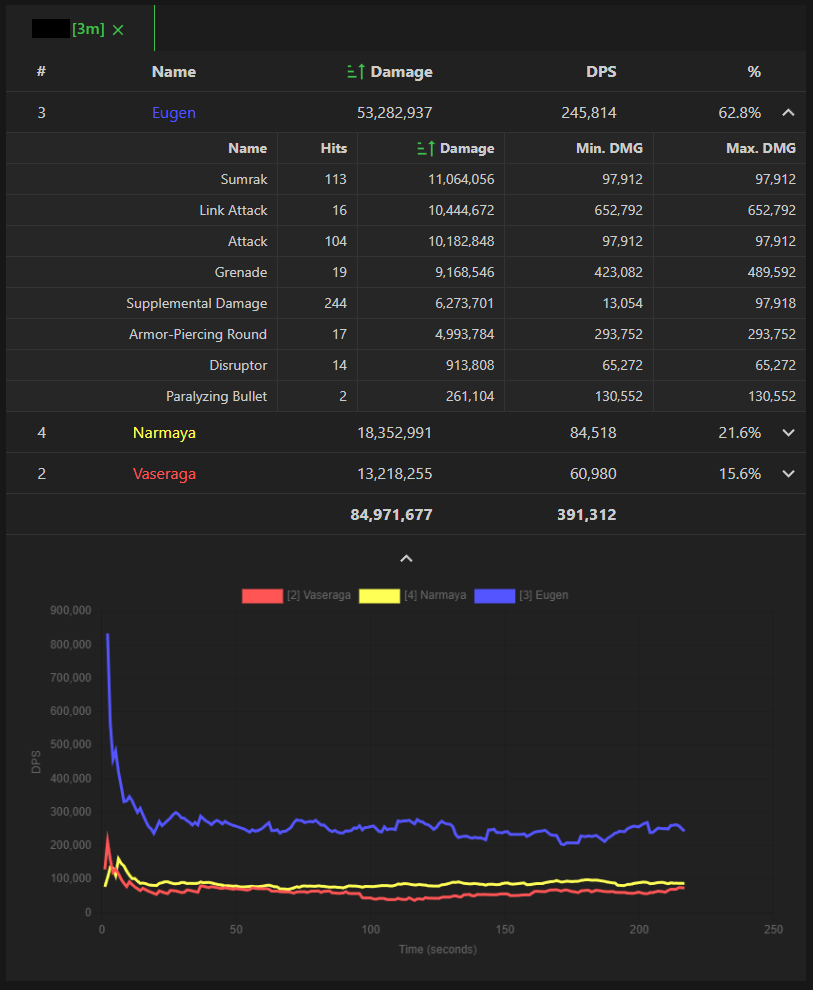

# gbfr-parser

### Steps

1. **Install Python 3.11**
   - Download link: [https://www.python.org/ftp/python/3.11.6/python-3.11.6-amd64.exe](https://www.python.org/ftp/python/3.11.6/python-3.11.6-amd64.exe)
   - Note: It is recommended to install with administrator privileges.
   - Note 2: This script does not support conda environments well, it is advised not to use conda environments.

2. **Run act_ws.py or uac_start.cmd**
   - Double-click `act_ws.py` or `uac_start.cmd` to run. If there are no issues, a cmd window will pop up indicating that ACT has been successfully installed.

3. **Open act_ws.html**
   - It is recommended to use Chrome browser to open `index.html`.

  Troubleshoot 
  -If act_ws.py or uac_start.cmd does not start, you may have an easier time using a second hand application such as Visual Studio Code or other alternatives to launch the terminal. As long as the required python is installed the extension should be added automatically.
